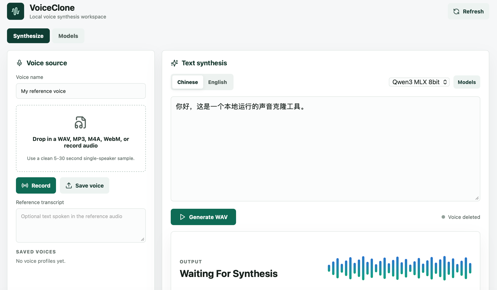

# VoiceClone-Web

VoiceClone-Web is a local web app for voice cloning on Apple Silicon Macs. It lets you record or upload a short reference voice, enter Chinese or English text, and generate a downloadable WAV file.



The app runs locally:

- Backend: FastAPI + Python, managed with `uv`
- Frontend: React + Vite
- TTS: MLX models through `mlx-audio`
- STT: optional Whisper model for auto-filling the reference transcript

Uploaded voices, generated WAV files, Hugging Face settings, and tokens stay on your machine.


## Requirements

- Apple Silicon Mac, 16 GB memory recommended
- macOS with Xcode Command Line Tools
- Homebrew
- Node.js 20+
- `uv`
- `ffmpeg`

Install the required tools:

```bash
xcode-select --install
brew install uv node ffmpeg
```

Check the tools:

```bash
uv --version
node --version
ffmpeg -version
```

## Install

Clone the repository:

```bash
git clone https://github.com/weijinfu/VoiceClone-Web.git
```

Enter the project root:

```bash
cd VoiceClone-Web
```

Install Python dependencies:

```bash
uv sync --extra dev --extra mlx
```

Install frontend dependencies:

```bash
cd frontend
npm install
```

Return to the project root:

```bash
cd ..
```

## Start The App

Start the backend in one terminal:

```bash
cd VoiceClone-Web
uv run voiceclone-api
```

The backend runs at:

```text
http://127.0.0.1:8000
```

Start the frontend in another terminal:

```bash
cd VoiceClone-Web/frontend
npm run dev
```

Open the app:

```text
http://127.0.0.1:5173/
```

## Download Models

Open the `Models` page in the app.

The default Hugging Face endpoint is:

```text
https://hf-mirror.com
```

You can switch to the official endpoint from the same page:

```text
https://huggingface.co
```

You can also paste a Hugging Face token in the `Models` page. This is optional, but it can help with authenticated or rate-limited downloads.

Recommended first setup:

1. Download `Qwen3 MLX 8bit`.
2. Download `Whisper STT` if you want automatic reference transcript filling.
3. Download `Chatterbox MLX` only if you want to compare the fallback TTS engine.

## Models

### Qwen3 MLX 8bit

Default TTS model:

```text
mlx-community/Qwen3-TTS-12Hz-1.7B-Base-8bit
```

Engine name:

```text
qwen3_mlx
```

### Chatterbox MLX

Fallback TTS model:

```text
mlx-community/chatterbox-fp16
```

Engine name:

```text
chatterbox_mlx
```

### Whisper STT

Reference audio transcription model:

```text
mlx-community/whisper-large-v3-turbo-asr-fp16
```

Used when `Reference transcript` is empty during voice saving.

## Use The App

### Create A Voice

1. Open `Synthesize`.
2. Enter a voice name.
3. Record audio or upload an audio file.
4. Use a clean 5-30 second single-speaker sample.
5. Optionally enter the spoken text in `Reference transcript`.
6. Click `Save voice`.

If `Reference transcript` is empty and Whisper STT is downloaded, the app will transcribe the reference audio and fill the field automatically.

Supported audio formats:

```text
WAV, MP3, M4A, AAC, FLAC, WebM
```

### Generate A WAV

1. Select a saved voice.
2. Choose `Chinese` or `English`.
3. Choose a model engine.
4. Enter the text to synthesize.
5. Click `Generate WAV`.
6. Preview the generated audio.
7. Click `Download WAV`.

Generated files are saved under:

```text
data/outputs
```

## Local Files

The app creates local runtime files:

```text
data/voices
data/outputs
data/jobs.json
data/voices.json
data/hf_endpoint
data/hf_token
```

Python and frontend dependencies are stored in:

```text
.venv
frontend/node_modules
```

Hugging Face model cache is stored under:

```text
~/.cache/huggingface
```

These local data and model files should not be committed.

## Useful Commands

Build the frontend:

```bash
cd VoiceClone-Web/frontend
npm run build
```

Run the backend with the lightweight test engine:

```bash
cd VoiceClone-Web
VOICECLONE_ENGINE=tone uv run voiceclone-api
```

## Configuration

Common environment variables:

```bash
VOICECLONE_DATA_DIR=data
VOICECLONE_ENGINE=qwen3_mlx
VOICECLONE_QWEN3_MODEL=mlx-community/Qwen3-TTS-12Hz-1.7B-Base-8bit
VOICECLONE_CHATTERBOX_MODEL=mlx-community/chatterbox-fp16
VOICECLONE_SYNTHESIS_TIMEOUT=600
VOICECLONE_STT_TIMEOUT=180
HF_ENDPOINT=https://hf-mirror.com
HF_HOME=~/.cache/huggingface
```

The endpoint and token can also be configured in the app from the `Models` page.

## Notes

- The full voice cloning workflow is intended for Apple Silicon Macs because the project uses MLX.
- The frontend and FastAPI app can run on other systems, but the MLX TTS/STT engines require Apple Silicon.
- The app performs zero-shot voice cloning only; it does not train or fine-tune voices.
